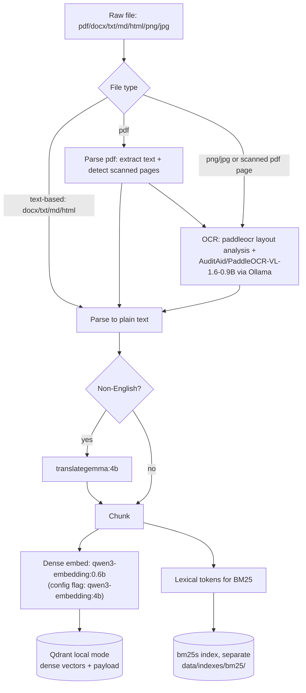
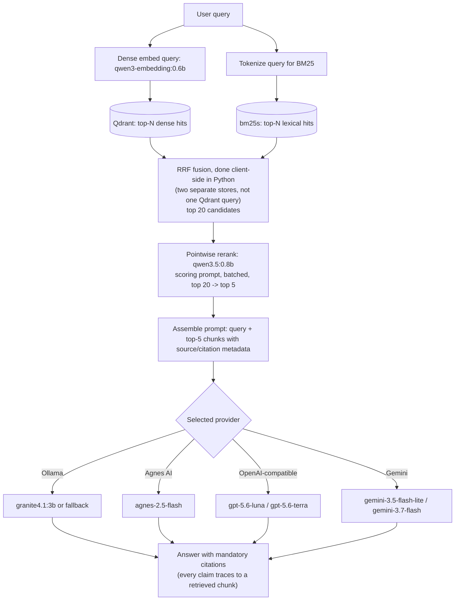

# Architecture

Two paths: **ingest** (build the index) and **request** (answer a query, ending in a cited
answer). Both are fully implemented (`SPEC.md`'s phase plan, Phases 2-6); only the Streamlit UI
(Phase 7) and eval are layered on top of these two paths, not a third path of their own.

## Implemented store (Phase 4)

- **Vector store: Qdrant, local mode** (`QdrantClient(path=".../qdrant_db")`), one collection
  named `chunks`, a single unnamed dense vector per point (`Distance.COSINE`). Verified working
  on Windows in this project (pulls in `pywin32`/`portalocker` for file locking, no compilation,
  no Docker).
- **Embedding dimension: 1024** with the default embed model (`qwen3-embedding:0.6b`) — measured
  empirically via a real `ollama.Client().embed()` call, not assumed. Switching
  `--embed-model` to `qwen3-embedding:4b` produces **2560**-dim vectors instead; the two are
  **not interchangeable on an existing collection** — `vector_store.ensure_collection` raises if
  the configured model's dimension doesn't match an already-created collection's dimension.
- **Lexical store: a separate `bm25s` index**, saved under `data/indexes/bm25/`, over the exact
  same chunk texts — not Qdrant sparse vectors. This supersedes the Phase 0 plan (Qdrant
  dense+sparse in one collection); see `docs/TECHNICAL.md` for why the plan changed and why
  `bm25s` was picked over `rank_bm25`.
- Point identity is deterministic (`uuid5` of `doc_id:chunk_index`), so re-indexing a changed
  chunk upserts in place instead of creating a duplicate — see `docs/TECHNICAL.md`.

## Ingest path

## Request path

## Design constraints reflected above

- **Hybrid retrieval is dense + BM25, fused with RRF** — not a neural reranker acting as the
  first-stage retriever, and not dense-only. Dense vectors and the BM25 index live in **two
  separate on-disk stores** (Qdrant local mode + `bm25s`), not one Qdrant collection with native
  sparse vectors as originally planned in Phase 0 — `retrieve/fusion.py` fuses the two result
  lists with RRF itself in Python, not via a single Qdrant `FusionQuery`. See `docs/TECHNICAL.md`
  for why the plan changed.
- **Reranking is pointwise, not listwise**, using `qwen3.5:0.8b` because there is no dedicated
  reranker model on the allowlist.
- **Citations are mandatory at generation time, enforced by the system prompt, not by code.**
  `generate/prompt.py` tags every retrieved chunk `[S1]`, `[S2]`, ... and instructs the model to
  cite every factual sentence, say so when the sources are insufficient, and treat source text as
  data rather than instructions (see `docs/THREAT_NOTES.md`). `generate/citations.py` drops any
  citation index outside the retrieved range, but nothing verifies a citation's source actually
  supports the sentence it's attached to at query time — see `docs/THREAT_NOTES.md`'s citation
  hallucination section for what is and isn't covered.
- Only one heavy Ollama model is resident at a time for ingest and index (implemented — see
  `docs/TECHNICAL.md`'s unload rules); retrieve/generate call the embed and rerank/generate
  models per query but do not currently unload between them within a single query.
