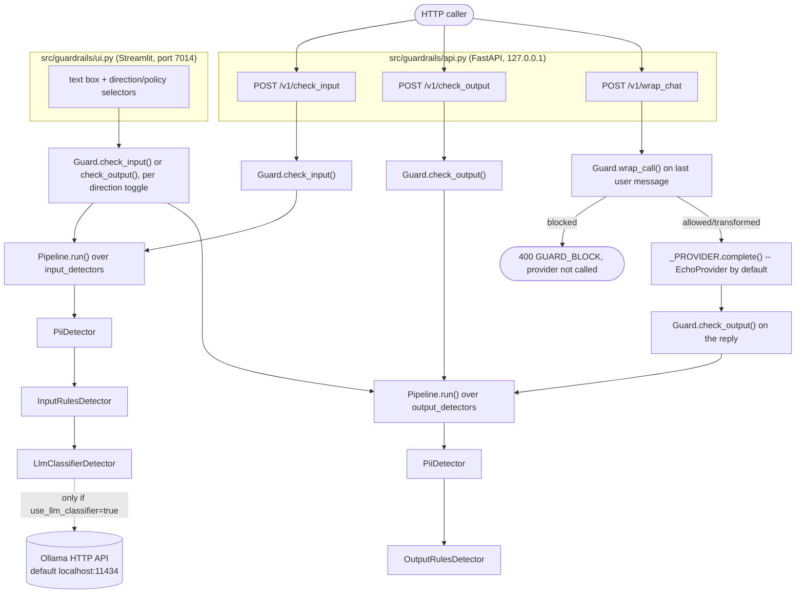

# Architecture

This describes the code as it currently stands, verified against `src/guardrails/`. For the
build history behind these decisions, see `docs/PHASES.md` and the per-phase notes it links to;
this file only describes present-day structure.

## Entry points

Two separate processes read the same library, each building its own `Guard` instance. They do
not call each other; the Streamlit UI does not go through the HTTP API.

Notes on this diagram, all checked against source:

- `api.py`'s shared `Guard` is built once at module import with exactly the detector lists shown
  (`input_detectors=[PiiDetector(), InputRulesDetector(), LlmClassifierDetector()]`,
  `output_detectors=[PiiDetector(), OutputRulesDetector()]`).
- `_PROVIDER` (`EchoProvider`, `api.py`) is the module-level default for `/v1/wrap_chat`: its
  `complete()` returns the last message's `content` unchanged. It exists so the endpoint is
  exercisable without a real LLM provider wired in; swapping it means editing `_PROVIDER` in
  `api.py`, there's no config switch for it.
- `ui.py` builds a separate `Guard` per "Check" click, with the same input detectors plus
  `EmbeddingSimilarityDetector`. Its toggles flip `use_llm_classifier`/`embedding_lane.enabled`
  on an in-memory copy of `DEFAULT_CLASSIFIER_CONFIG` (the Python constant in `providers.py`) ;
  like `api.py`, `ui.py` never reads `config/classifier.yaml` itself; see README's
  "Configuration" section. It uses `guard.check_input`/`check_output` directly, never
  `wrap_call`.
- `Pipeline.run()` applies each detector's output to the working text before the next detector
  runs (`apply_spans`, `models.py`); order in the list matters. This is why `PiiDetector` is
  first in both lists in both `api.py` and `ui.py`.
- `LlmClassifierDetector`/`EmbeddingSimilarityDetector` only make an outbound HTTP call at all if
  their respective config keys (`use_llm_classifier`, `embedding_lane.enabled` in
  `config/classifier.yaml`, both `false` by default) are on.

## Main types and where they live

| Type | File | Role |
|---|---|---|
| `Span` | `models.py` | one matched region: `start`, `end`, `type`, `score`, optional `replacement` |
| `Finding` | `models.py` | one detector's result for a run: `detector_id`, `severity` (`info`/`warn`/`block`), `spans`, `message` |
| `GuardContext` | `models.py` | passed to every detector: `direction`, `tenant`, `route`, `fail_mode` |
| `GuardDecision` | `models.py` | a pipeline run's outcome: `action` (`allow`/`transform`/`block`), `findings`, `text_in`, `text_out`, `policy`, `latency_ms` |
| `Policy` | `policies.py` | `Literal["strict", "standard", "observe"]`; see README's "Known limitations" for what this does and doesn't affect |
| `Detector` | `pipeline.py` | `Protocol`: `detector_id: str` + `run(text, context) -> Finding` |
| `Pipeline` | `pipeline.py` | runs an ordered `list[Detector]` once, aggregates into a `GuardDecision` |
| `Guard` | `pipeline.py` | holds one input `Pipeline` and one output `Pipeline`; `check_input`/`check_output`/`wrap_call` |
| `GuardBlocked` | `pipeline.py` | raised by `wrap_call` when the last user message is blocked |
| `SafeMessages` | `pipeline.py` | what `wrap_call` yields: the message list with the last user message's content replaced, plus the `GuardDecision` |

State: no database, no persistent process-level state beyond what's described above.
`EmbeddingSimilarityDetector` caches its 10 reference-phrase embeddings in an instance attribute
after the first call (`_reference_vectors`, `providers.py`); in-memory only, per-instance, not
shared across processes or written to disk.

## External systems

Verified by grepping `src/guardrails/` for outbound network calls (`urllib.request`, literal
`http://`/`https://`): the only file that makes one is `providers.py`. It calls a local Ollama
server (`OllamaClassifier`, `OllamaEmbedder`) at three endpoints: `GET /api/tags` (health check),
`POST /api/generate`, `POST /api/embeddings`. Default host is `http://localhost:11434`
(`config/classifier.yaml`'s `host` key). No other file in `src/` performs network I/O. No
database, message queue, or other external service is referenced anywhere in `src/`.
