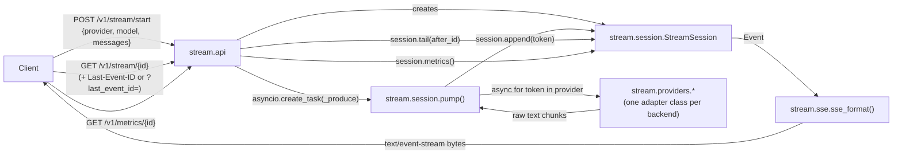

# Architecture

## Request/data flow

Verified against the actual call graph in `src/stream/api.py` and
`src/stream/session.py`, not a planned/aspirational diagram. One thing this
diagram intentionally leaves out: `src/stream/metrics.py`
(`time_stream`/`ttft_s`, operating on `stream.providers.base.TokenChunk`)
and `stream/providers/base.py`/`fake.py`'s `TokenChunk`-based
`StreamAdapter`/`FakeAdapter` are a second, separate contract in this
codebase. They exist and are exercised by `tests/test_fake_adapter.py`, but
nothing in `stream.api`'s request path imports or calls them; the live
pipeline's adapters (`OllamaAdapter`, `OpenAICompatAdapter`, `GeminiAdapter`,
`FakeProvider`) yield plain `str` chunks directly into `pump()`, not
`TokenChunk`s. Both contracts are real code; only one is wired to HTTP.

## Main types and state

| Type | File | Holds |
|---|---|---|
| `StreamSession` | `src/stream/session.py` | Per-session event log (`deque[Event]`, bounded by `max_events`/`ttl_s`), TTFT/token-count/done-reason state, the backpressure counters (`buffer_len`, watermark ack state), `connect_count`. All in-process memory; see "State" in `docs/RUNBOOK.md`. |
| `Event` | `src/stream/session.py` | One SSE event: `id`, `type` (`"token"`/`"error"`/`"done"`), `data`, `ts_monotonic`. |
| `_sessions` | `src/stream/api.py` (module-level dict) | `session_id -> StreamSession`, the only registry of live sessions. Never pruned. |
| `PROVIDERS` / `ProviderStatus` | `src/stream/config.py` | Per-provider `enabled` flag + human-readable `reason`, checked by `stream.api._build_adapter` before a session is ever created. |
| `BackpressureConfig` | `src/stream/config.py` | `high_watermark`/`low_watermark`/`drop_oldest_replayable`/`poll_interval_s`, consumed by `stream.session.pump()`. |
| `OllamaAdapter` / `OpenAICompatAdapter` / `GeminiAdapter` / `FakeProvider` | `src/stream/providers/` | One instance per in-flight generation; each exposes `.usage` (`dict | None`, populated from the provider's own final chunk if it sends one, never fabricated). |

## External systems

- **Ollama**, `http://127.0.0.1:11434/api/chat` (`stream/providers/ollama.py`)
 ; local, no auth.
- **An OpenAI-compatible endpoint** at `OPENAI_BASE_URL` +
  `/chat/completions`, Bearer auth via `OPENAI_API_KEY`
  (`stream/providers/openai_compat.py`).
- **Agnes AI**, `https://apihub.agnes-ai.com/v1/chat/completions`
  (hardcoded in `stream/config.py`), Bearer auth via `AGNESAI_API_KEY` ;
  reuses the same `OpenAICompatAdapter` class as above.
- **Gemini**, `https://generativelanguage.googleapis.com/v1beta/models/
  {model}:streamGenerateContent`, `?key=GOOGLE_API_KEY`
  (`stream/providers/gemini.py`). Built but not verified working; see the
  "Known limitations" list in `README.md`.

No database, no message queue, no other outbound network call exists in
`src/`.
