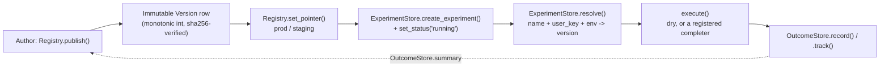

# Architecture

## Request/data flow



Every box is a real call, traceable in `src/promptreg/`:

- `Registry.publish` (`registry/storage.py`) only ever inserts; there is
  no update path for a `Version` row.
- `Registry.set_pointer` / `Registry.rollback` (`registry/storage.py`)
  move a `Pointer` row for one `(prompt, env)`; they never touch `Version`
  rows or the body files on disk.
- `ExperimentStore.resolve` (`split/storage.py`) is the actual fan-in
  point: it checks for a running/paused `Experiment` first (sticky
  `Assignment` lookup, or a fresh hash-based pick while running), and
  falls back to `Registry.get_pointer` only when there is no experiment in
  play. See `docs/SPLIT.md`.
- `execute` (`execute/completer.py`) is a pass-through unless a completer
  is registered for `config.provider`; see "Known limitations" in the
  top-level `README.md`.
- `OutcomeStore.record` / `.track` (`outcomes/storage.py`) write to SQLite
  and append to a JSONL file; `OutcomeStore.summary` reads them back as
  per-arm descriptive stats (counts, rates, median latency; no
  significance testing, no Bayesian inference).

Two front ends drive this same flow: the FastAPI app
(`src/promptreg/api/app.py`) over HTTP, and the Streamlit UI
(`src/promptreg/ui/app.py`), which imports the same three classes
directly; no HTTP hop between the UI and the registry.

## Main types and where they live

| Type | Module | Storage |
|---|---|---|
| `Prompt`, `Version`, `Pointer` | `registry/models.py` | table `prompts`, `versions`, `pointers` (+ `pointer_history` audit log, internal) in `data/registry.db`; `Version` body text on disk at `data/prompts/<name>/<version>.md` |
| `Experiment`, `Assignment` | `split/models.py` | table `experiments` (arms as a JSON column), `assignments`, same `data/registry.db` file |
| `OutcomeEvent`, `OutcomeMetrics` | `outcomes/models.py` | table `outcomes`, same `data/registry.db` file, plus one JSON line per `record`/`track` call in `data/outcomes.jsonl` |
| `ExecutionResult` | `execute/models.py` | not persisted; passed in-memory from `execute()` to `OutcomeStore.record` |
| Pydantic request/response bodies | `api/schemas.py` | not persisted; HTTP layer only |

Full field-by-field schema: `docs/DATA.md`. All three stores
(`Registry`, `ExperimentStore`, `OutcomeStore`) read `PROMPTREG_DB_PATH`
independently and open/close their own `sqlite3` connections per call ;
there is no shared connection pool or in-memory cache in front of SQLite.

## External systems the code calls

None, as shipped. `execute()`'s `COMPLETERS` dict
(`src/promptreg/execute/completer.py`) is empty by default, so no
network call to any LLM provider happens anywhere in this repository
today. The Streamlit UI and the CLI both talk only to the local SQLite
file and local filesystem. The only network listener this code opens is
the FastAPI server itself (`127.0.0.1`, not `0.0.0.0`).

## Module map (`src/promptreg/`)

| Module | Owns |
|---|---|
| `registry` | `Prompt`, `Version`, `Pointer` storage + rollback |
| `split` | `Experiment`, `Assignment`, weighted/sticky `resolve` |
| `execute` | Optional LLM call (dry by default, no completer registered) + `str.format_map` template `render` |
| `outcomes` | Outcome event storage (SQLite + JSONL) + per-arm descriptive `summary` |
| `api` | FastAPI HTTP API, `127.0.0.1` only |
| `ui` | Streamlit admin UI, port from `.streamlit/config.toml` |

## CLI

```
uv run python -m promptreg.registry resolve --name support --user u1
uv run python -m promptreg.outcomes summary --experiment 1
```

`resolve` runs the full pipeline (resolve -> execute -> record) and prints
the `request_id` for a later `OutcomeStore.track(...)` call; there is no
`track` CLI subcommand, that one is a library call only. Neither CLI has a
publish, pointer, rollback, or experiment-management subcommand.

## Streamlit UI (`src/promptreg/ui/app.py`)

Run: `uv run streamlit run src/promptreg/ui/app.py` (or `run.cmd`, which
also starts the API). Talks to `Registry`/`ExperimentStore`/`OutcomeStore`
directly; no HTTP, no admin token; it *is* the trusted local admin tool.
Same `PROMPTREG_DB_PATH`/`PROMPTREG_PROMPTS_DIR`/`PROMPTREG_OUTCOMES_JSONL`
env vars as the API/CLI. Port and theme are set in
`.streamlit/config.toml`, not CLI flags or CSS.

Five tabs per selected prompt: Versions (table + prod/staging pointer),
Publish (form -> `Registry.publish`, always a new version), Pointer &
rollback (`set_pointer`/`rollback` per env), Experiments (create form with
weight validation delegated to `validate_arms`, plus Start/Stop on
existing experiments), Outcomes (`OutcomeStore.summary` as a table; n,
ok_rate, thumbs_net, p50_latency_ms; with an explicit "descriptive counts
only" caption). Mutating actions use a session-state flash-message
pattern (`_flash`/`_set_flash`) around `st.rerun()`, since Streamlit
discards anything shown right before a forced rerun.

`scripts/seed_demo.py` publishes `greet` v1/v2, starts a 50/50 experiment,
and resolves + tracks outcomes for 20 fake users; meant for a fresh
`data/` dir (not safely re-runnable against the same one, see its
docstring).

## HTTP API (`src/promptreg/api/`)

Run: `uv run python -m promptreg.api` (or `run.cmd`); binds
`127.0.0.1:8000` (`PROMPTREG_API_PORT` to override). Storage paths and the
admin token come from env vars read at startup: `PROMPTREG_DB_PATH`,
`PROMPTREG_PROMPTS_DIR`, `PROMPTREG_OUTCOMES_JSONL`,
`PROMPTREG_ADMIN_TOKEN` (generated + printed once if unset).

| Route | Auth | Notes |
|---|---|---|
| `POST /v1/prompts/{name}/versions` | `X-Admin-Token` | = `Registry.publish` |
| `GET /v1/prompts/{name}/versions` | open | = `Registry.list_versions` (metadata only, no disk read) |
| `PUT /v1/prompts/{name}/pointer/{env}` | `X-Admin-Token` | = `Registry.set_pointer` |
| `POST /v1/prompts/{name}/rollback/{env}` | `X-Admin-Token` | = `Registry.rollback` |
| `POST /v1/experiments` | `X-Admin-Token` | = `ExperimentStore.create_experiment` (starts in `draft`) |
| `POST /v1/experiments/{experiment_id}/start` | `X-Admin-Token` | = `set_status(..., "running")` |
| `POST /v1/experiments/{experiment_id}/stop` | `X-Admin-Token` | = `set_status(..., "stopped")` (no `/pause` route; library-only) |
| `POST /v1/resolve` | open | lookup only: resolution + version body/config, no execute, no outcome recorded |
| `POST /v1/complete` | open | full pipeline: resolve -> render (`str.format_map`, missing var -> 400) -> execute -> record; returns `request_id` |
| `POST /v1/outcomes` | `X-Admin-Token` | = `OutcomeStore.track` (attach thumbs/task_ok/tokens_out/custom to a `request_id`) |

`KeyError` -> 404, `ValueError` -> 400, `IntegrityError` -> 500,
`TemplateRenderError` -> 400; mapped centrally via `@app.exception_handler`,
not per-route try/except.

Two deliberate deviations from a literal reading of an earlier route
spec, both functionally equivalent: the experiment path param is
`{experiment_id}`, not `{id}` (avoids shadowing the `id` builtin);
`/v1/resolve` never writes an outcome (nothing was executed yet to report
on); only `/v1/complete` does, since it's the one that renders and runs
the version.

## State

Everything durable lives in one SQLite file (`data/registry.db`) plus the
prompt-body files and the outcomes JSONL; that's the only cross-process,
cross-restart state. Everything else is in-process and ephemeral:

- The API's `Registry`/`ExperimentStore`/`OutcomeStore` instances and admin
  token live in `app.state`, built fresh in `lifespan` every time the
  process starts. No `PROMPTREG_ADMIN_TOKEN` set -> a new random token
  generates on every restart; the old one stops working immediately.
- The Streamlit UI's store instances are `st.cache_resource`-cached per
  Streamlit server process; same lifetime rule, gone on restart.
- Nothing here is distributed or shared-nothing across multiple processes
  beyond the one SQLite file; two `promptreg.api` processes pointed at the
  same `PROMPTREG_DB_PATH` would both read/write it correctly (SQLite
  handles that), but each would mint its own independent admin token.

**The sticky-assignment hash is not a security mechanism.** `sha256(user_key
+ sticky_salt) % 100` (see `docs/SPLIT.md`) exists purely to bucket
traffic deterministically and evenly; it is not authentication, not a
signature, and not tamper-evident. `sticky_salt` is a decorrelation value,
not a secret: nothing bad happens if a caller learns it, and it is never
treated as one (stored in plain SQLite, no hashing/encryption of its own).
Don't repurpose either the hash or the salt as an identity or integrity
check for `user_key`.

Full field-level data model: `docs/DATA.md`. Stack rationale, invariants,
and error handling: `docs/TECHNICAL.md`.
