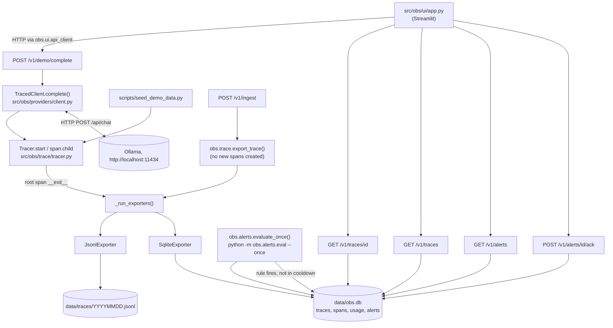

# Architecture

Single process per service (one FastAPI process, one Streamlit process),
communicating over local HTTP. No message queue, no separate worker
process, no database server — SQLite and flat files on the local disk.

## Data flow

Both exporters run independently: `_run_exporters` (`src/obs/trace/tracer.py`)
wraps each registered exporter call in its own `try/except`, so one
exporter failing does not stop the other or re-raise to the caller — it
only logs (`logging.getLogger(__name__).warning(...)`).

## Main types and where they live

| Type | File | Notes |
|---|---|---|
| `SpanContext`, `Span`, `Usage`, `Trace` | `src/obs/trace/models.py` | pydantic models; see `docs/SCHEMA.md` |
| `SpanHandle`, `Tracer` | `src/obs/trace/tracer.py` | context-manager API; module-level state below |
| `Alert` | `src/obs/alerts/models.py` | pydantic model; see `docs/SCHEMA.md` |
| `AlertsConfig` and per-rule config models | `src/obs/alerts/config.py` | loaded from `config/alerts.yaml` |
| `CompletionResult`, `ProviderAdapter` (protocol), `TracedCompletion` | `src/obs/providers/base.py`, `src/obs/providers/client.py` | |
| `ModelRate` | `src/obs/metrics/pricing.py` | loaded from `config/prices.yaml` |

Module-level mutable state (all in-process, not persisted, reset by
restarting the process):

- `_current_span`, `_current_trace` — `contextvars.ContextVar`s in
  `src/obs/trace/tracer.py`, used so a nested `Tracer.start`/`span.child`
  call finds its parent without the caller threading a span object through
  every function call.
- `_finished_traces` — plain list in `src/obs/trace/tracer.py`, all traces
  finished in this process.
- `_exporters` — plain list of callables in `src/obs/trace/tracer.py`;
  empty until something calls `register_exporter`/`register_default_exporters`.
- `_cache` — `src/obs/metrics/pricing.py`, the loaded price table, lazily
  populated on first `estimate_cost` call and never invalidated except by
  `clear_prices_cache()` (used in tests).

## Modules (`src/obs/`)

| Package | Responsibility |
|---|---|
| `trace` | `Tracer`/`SpanHandle`, contextvar-based span nesting, redaction, in-memory trace list, exporter registration/dispatch |
| `export` | `JsonlExporter`, `SqliteExporter`, `get_trace`/`query` readers, `python -m obs.export --day --summary` CLI |
| `metrics` | `config/prices.yaml` loader, `estimate_cost` |
| `alerts` | on-read rolling-window stats, rule checks (`src/obs/alerts/rules.py`), cooldown/store, `python -m obs.alerts.eval --once` CLI |
| `providers` | `TracedClient`, `ProviderAdapter` protocol, `OllamaAdapter` (the only adapter implemented) |
| `api` | FastAPI app (`src/obs/api/app.py`); `obs.api`'s `__init__.py` deliberately re-exports nothing (see its docstring for why) |
| `ui` | Streamlit app (`src/obs/ui/app.py`) and its HTTP client of the API (`src/obs/ui/api_client.py`) |

## External systems

Exactly one: `http://localhost:11434`, Ollama's HTTP API
(`src/obs/providers/ollama.py`, `POST /api/chat`). Nothing else in this
codebase makes an outbound network call — the FastAPI app is a server, not
a caller of anything external, and the Streamlit app only calls the local
FastAPI app.

## Superseded code

`obs_legacy/` (repo root, not under `src/`) is an earlier package with a
flat trace-record schema, predating the span-based model above. Nothing
under `src/obs/` or `scripts/` imports it. Only `tests/test_redact.py` and
`tests/test_storage.py` still import from it.
