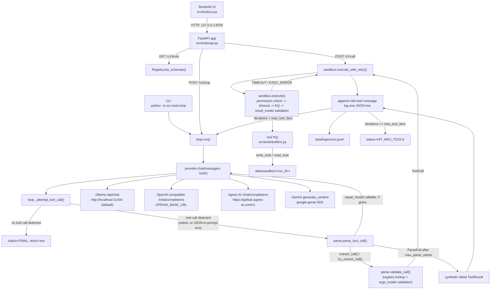

# Architecture

## Request/data flow

Two entry points reach `loop.run()`: the CLI (`src/tools/loop.py`'s
`_main`, invoked as `python -m src.tools.loop`) and `POST /v1/loop` on the
FastAPI app. `POST /v1/call` and the UI's "Manual call" tab skip the model
and the parse step entirely, calling `sandbox.execute_with_retry()`
directly with a caller-supplied `{name, args}` pair. `GET /v1/tools` never
touches the model or sandbox at all — it only reads whatever
`register_builtins()` put in the module-level `Registry` at API startup.

## Main types and state

| Type | Defined in | What it holds |
|---|---|---|
| `ToolSpec`, `ToolPermissions`, `ToolArgs` | `src/tools/schema.py` | A tool's static contract: name, description, args/result pydantic models, permission flags, `timeout_s`, `max_retries`. `ToolArgs` is the pydantic base every tool's args model subclasses (`extra="forbid"`). |
| `Registry` | `src/tools/registry.py` | In-memory `dict[str, ToolSpec]`, populated once by `register_builtins()`. Not persisted; rebuilt from `builtins.py` every process start. |
| `ToolCall`, `ToolError`, `ToolErrorCode`, `ToolResult`, `ParseFail` | `src/tools/parse.py` | A call in flight: `ToolCall` (tool name + validated args), `ToolResult` (outcome: `ok`, `value`, `error`, `duration_ms`, `attempts`), `ToolError` (one of 7 `ToolErrorCode` values), `ParseFail` (exception carrying every failed attempt's `ToolError`). |
| `ProviderReply`, `Provider` | `src/tools/providers.py` | `ProviderReply` is one model turn (`text`, `native_tool_calls`). `Provider` is a `typing.Protocol` — any object with a matching `chat()` method satisfies it (used by tests to inject a fake). |
| `LoopStatus` | `src/tools/loop.py` | `StrEnum` with two values: `FINAL`, `HIT_MAX_TOOLS`. |
| Conversation `messages` | Passed through `loop.run()`, held in Streamlit's `st.session_state.chat_messages` between UI reruns | A list of `{"role", "content", ...}` dicts; not a formal type, just the shape `loop.run()` builds and returns. |

State that outlives one process run, all under `data/` (both directories
are gitignored per `.gitignore`, with only a `.gitkeep` tracked):

- `data/sandbox/<run_id>/` — files a tool wrote via `sandbox_path()`
  (currently only `write_note`/`read_note`).
- `data/logs/runs.jsonl` — one JSON object per loop iteration, appended by
  `loop._log_iteration()`. Long strings (over `loop.REDACT_MAX_LEN`, 200
  characters) are replaced with `<redacted: N chars>` before writing.

## External systems

Everything below is optional at import time — only whichever provider is
selected for a given call needs its environment variable(s) set (see
README, Configuration). None of these are called by the FastAPI or
Streamlit layers directly; only `src/tools/providers.py` calls out.

| System | How it's called | Module |
|---|---|---|
| Ollama (local LLM server) | `requests.post` to `{OLLAMA_HOST}/api/chat` (default `http://localhost:11434`) | `OllamaProvider` |
| An OpenAI-compatible chat endpoint | `requests.post` to `{OPENAI_BASE_URL}/chat/completions`, bearer `OPENAI_API_KEY` | `OpenAICompatibleProvider` |
| Agnes AI | `requests.post` to `https://apihub.agnes-ai.com/v1/chat/completions`, bearer `AGNESAI_API_KEY` | `AgnesProvider` |
| Google Gemini | `google.genai.Client(api_key=GOOGLE_API_KEY).models.generate_content(...)` | `GeminiProvider` |

No database, message queue, or other external service is called anywhere
in `src/tools/`.
