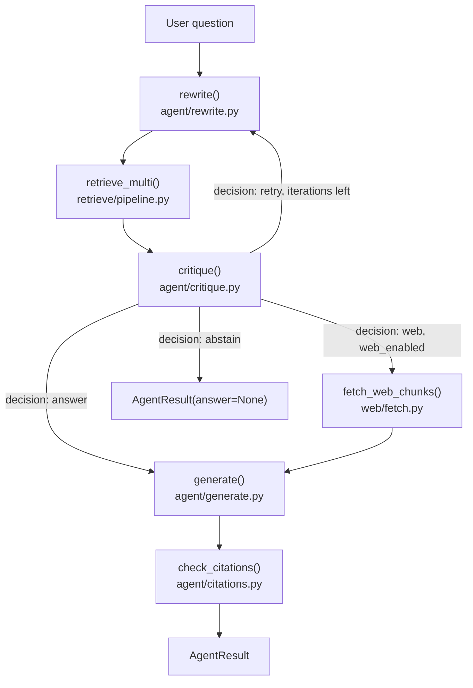

# Architecture

## Data flow

All of this is orchestrated by `agent/loop.py:run()`. A second entry point,
`agent/loop.py:run_safe()`, wraps `run()` and converts any exception into an
`AgentResult(answer=None, reason=...)` instead of propagating it -- the Streamlit UI
(`ui/app.py`) and the eval runner (`eval/pipeline.py`) both call `run_safe()`, not `run()`,
for that reason.

`critique()`'s own `decision` field is a model-proposed recommendation.
`agent/critique.py:enforce_decision()` recomputes the actual decision in code from the
critique's `grounded` score, whether any chunk was retrieved, remaining iterations, and
`LoopPolicy.web_enabled` -- see `docs/LOOP.md` for the exact table.

## Main types and where they live

| Type | File | Holds |
|---|---|---|
| `RewriteResult` | `agent/schemas.py` | 1-3 rewritten queries + a rationale string |
| `CritiqueResult` | `agent/schemas.py` | `grounded`, `coverage` (both 0-1), `missing[]`, `decision`, `rationale` |
| `LoopPolicy` | `agent/schemas.py` | `max_iters`, `confidence_threshold`, `web_enabled`, `citation_fail_closed` |
| `AgentStep` / `AgentTrace` | `agent/schemas.py` | one step's `iteration`/`stage`/`summary`/`detail`; a list of them |
| `AgentResult` | `agent/schemas.py` | the loop's final output: `answer`, `reason`, `confidence`, `citations`, `trace` |
| `RetrievalResult` | `retrieve/records.py` | one retrieved chunk: `chunk_id`, `text`, `source_path`, `page`, `score` |
| `Chunk` | `ingest/records.py` | one chunk produced during ingest, before embedding |
| `WebResult` | `web/base.py` | one web search hit: `title`, `url`, `snippet` |
| `WebChunk` | `web/records.py` | one fetched web page's text, ready to cite as `[W#]` |
| `Settings` | `config.py` | env-backed configuration (`pydantic-settings`) |

On-disk state:
- `data/indexes/qdrant/` -- a single Qdrant local-mode collection named `chunks`
  (`index/vector_store.py:COLLECTION_NAME`), holding dense vectors and a payload
  (`text`, `source_path`, `page`) per point.
- `data/indexes/bm25/` -- `bm25s`'s saved lexical index files
  (`index/lexical_store.py:BM25_DIRNAME`).
- Nothing else persists. There is no other database, and no session state beyond a Streamlit
  rerun: `ui/app.py` re-reads the index and calls `run_safe()` fresh on every question.

## External systems

| System | Where | Reached when |
|---|---|---|
| Ollama (`OLLAMA_HOST`, default `http://127.0.0.1:11434`) | `llm/ollama_provider.py`, `llm/vram.py` | Always, for the default provider: embedding, rewrite/critique, and (by default) answer generation. |
| Agnes AI (`https://apihub.agnes-ai.com/v1`, fixed in `config.py`) | `llm/agnes_provider.py` | Only if `agnes` is selected as the provider and `AGNESAI_API_KEY` is set. |
| A user-supplied OpenAI-compatible endpoint (`OPENAI_BASE_URL`) | `llm/openai_provider.py` | Only if `openai_compatible` is selected and both `OPENAI_API_KEY`/`OPENAI_BASE_URL` are set. |
| Google Gemini (via the `google-genai` SDK) | `llm/gemini_provider.py` | Only if `gemini` is selected and `GOOGLE_API_KEY` is set. |
| Firecrawl (`https://api.firecrawl.dev` by default, `SEARCH_BASE_URL` to override), `POST /v2/search` | `web/http_search.py` | Only when web fallback fires (`enforce_decision` reaches `"web"`) and `SEARCH_API_KEY` is set. |
| Arbitrary URLs returned by the web search | `web/http_fetch.py`, gated by `web/safety.py` | Only immediately after the Firecrawl call above, one fetch per returned URL that passes the scheme/private-IP check. |

No database server, message queue, or other network service beyond the above is called from
this code (verified: `web/` and `llm/` are the only packages performing network I/O; `index/`
and `retrieve/` talk to Qdrant's embedded, in-process client, not a remote server).
