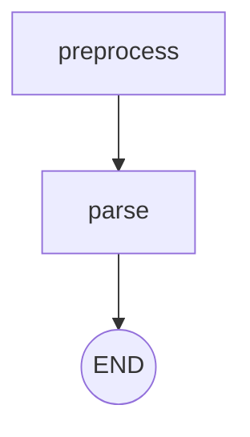

# Architecture

Each document uses one LangGraph `StateGraph`. Page requests use a bounded
thread pool; the application has no multi-agent chat or separate service.

## Active graph

| Node | Responsibility |
|---|---|
| `preprocess` | Load the first page as a capped-size image, compute `doc_sha256`, and initialize missing run metadata/usage for direct compiled-graph callers. File/rendering errors can propagate. |
| `parse` | Re-render the selected inclusive page range and parse layout via `src/extract.py`, with at most 50 concurrent single-image calls. Record per-page diagnostics; when any page succeeds, save Markdown and attempt annotation. Parse-step exceptions become `parse_error`/`status`; annotation exceptions are logged without discarding the parse. |

`run_graph()` creates a fresh usage ledger and artifact directory for every run.
It streams page-completion events to an optional `on_progress` callback on the
caller thread and returns the final state with `token_usage`. Results are sorted
into source order after page calls finish. Each progress event has `completed`,
`total`, `successful`, and `failed` counts. Artifact generation follows page
parsing. The UI renders HTML from the current `ParseResult`; no LLM or graph node
generates it. Only the selected preview tab is rendered.

There is no `commit`/`review` split today: `parse` -> `END` regardless of
outcome, and nothing is written to `data/committed/` or `data/review/`.

### Drawing on PDFs without a PDF library

`src/annotate.py` uses neither `pypdf` nor `reportlab`. `preprocess_pages`
rasterizes each page to a PIL image through `pypdfium2`, and Pillow writes the
multi-page PDF with `Image.save(path, "PDF", save_all=True, append_images=[...])`.
`annotate_document` re-renders the covered pages, draws boxes with `ImageDraw`,
and saves the PDF with Pillow. It also saves each annotated page as
`data/parse/runs/<run_id>/annotated/<doc_sha>/page_NNN.png`, so the UI can show an inline
preview without a PDF-viewer widget.

## Main types and state

| Type | Lives in | Holds |
|---|---|---|
| `GraphState` (TypedDict) | `src/graph.py` | The graph's own state: `image_path`, `start_page`/`end_page`, `model`, `doc_sha`, `base64_image`/`mime`, `parse_result`, `markdown`, `parse_error`, `annotated_pdf_path`, `annotated_page_paths`, `markdown_path`, `parse_json_path`, `run_id`, `output_dir`, `token_usage`, `status`. |
| `ParseResult` / `ParsePage` / `ParseBlock` / `BBox` | `src/schema.py` | The active schema: one `ParsePage` (with `blocks: list[ParseBlock]`) per page; `BBox.xyxy` and (dormant) `Region.bbox_xyxy` are normalized 0-1 coordinates, always exactly 4 values, enforced by a `field_validator`. |
| `PageDiagnostic` | `src/diagnostics.py` | Per-page call outcome (`parsed`/`content_filtered`/`refused`/`incomplete`/`invalid_response`/`http_error`/`transport_error`), HTTP status, sanitized request/model ids, token counts, filter annotations; never raw response text, headers, or credentials. |
| Token usage ledger | `src/usage.py` | Explicit per-run `list[dict]`, passed through page calls and retained on failures. Session totals belong to Streamlit session state. |
| `Invoice` / `LineItem` / `Region` / `ValidationReport` (dormant) | `src/schema.py` | The unwired invoice contract; see below. |

There is no database. Streamlit's `st.session_state` holds the sidebar page
range, latest parse result, and session token-usage list in `src/ui/app.py`.

## External systems

- **One OpenAI-compatible HTTP endpoint**; the only external system this
  project talks to. `OPENAI_API_KEY` (required) and `OPENAI_BASE_URL`
  (optional, for a gateway other than api.openai.com) configure it; every
  call goes through `_build_llm`/`_invoke_structured` in `src/extract.py`.
  See [docs/MODEL.md](MODEL.md) for the exact request shape.
- Nothing else: no database, no message queue, no other third-party API, no
  outbound network call besides that one endpoint.

## Dormant: the invoice extraction/validation graph

The graph used to continue past `parse` into an `extract -> validate ->
maybe_crop -> commit`/`review` cycle built on one contract: a vision model
*proposes* an `Invoice`, and `src/validate.py`'s plain-Python arithmetic
checks are the only authority on whether it's correct. That contract doesn't
fit real prior-auth documents; they have no `subtotal`/`grand_total` for
Python to check; so this half of the graph is **not wired into
`build_graph()`**. The code and its tests are untouched on disk for when a
validation model that actually fits prior-auth forms is defined:

| Node (not wired) | Lives in | Would have done |
|---|---|---|
| `extract` | `src/extract.py` (`extract_invoice`) | Vision LLM proposes an `Invoice`, given the image and (if available) the parsed Markdown as extra context. On a retry, prior validation errors are passed back as feedback. |
| `validate` | `src/validate.py` | Pure Python arithmetic check, no LLM involved. Would increment `retry_count` and record the error on failure. See [docs/VALIDATE.md](VALIDATE.md). |
| `maybe_crop` | `src/regions.py` + `src/extract.py` (`extract_regions`/`crop_and_extract`) | Runs at most once per `extract` attempt. For a failing line item, prefers a bbox the layout parser already found over asking the model again; falls back to a dedicated regions call for anything not already covered. Crops those regions and re-extracts just those fields. See [docs/REGIONS.md](REGIONS.md). |
| `commit` | removed from `graph.py` | Would write `data/committed/<doc_sha>.json` (the `Invoice` plus `markdown_path`/`annotated_pdf_path`) and an audit line via `src/audit.py`. |
| `review` | removed from `graph.py` | Would write `data/review/<doc_sha>.json` (invoice + last validation report + `markdown_path`/`annotated_pdf_path`) and an audit line. |

The routing that graph used to run (preserved here for whoever re-wires it):

From `validate`:
1. `report.ok` -> `commit`.
2. not ok, this `extract` attempt not yet cropped -> `maybe_crop`.
3. not ok, already cropped this attempt, `retry_count < max_retries` ->
   `extract` again (`cropped_this_iter` resets to `False`).
4. not ok, already cropped this attempt, `retry_count >= max_retries` ->
   `review`.

From `maybe_crop`:
- Crop applied -> back to `validate`, to check whether it fixed the problem.
- Nothing worth cropping -> routes directly to the decision `validate` would
  have made (`extract` again or `review`), rather than re-running `validate`
  and double-counting `retry_count`.

`retry_count` was initialized once by `preprocess` and never reset by it on
later visits; only `validate` incremented it, and only on a genuine
failure. The "retry `extract`" transition (from either `validate` or
`maybe_crop`) reset `cropped_this_iter` to `False`. Cropping was a
best-effort accuracy aid, not a required step: if the model returned no
bounding boxes, `maybe_crop` was a no-op and validation just failed forward
into the retry/review path.

`src/audit.py`'s `write_audit_line` is likewise unwired; no node in the
active graph calls it. See [docs/COMPLIANCE.md](COMPLIANCE.md) for what is
and isn't logged today, and
[docs/ADR-0001-UNWIRE-INVOICE-PIPELINE.md](ADR-0001-UNWIRE-INVOICE-PIPELINE.md)
for why this graph was unwired rather than deleted or adapted in place.
