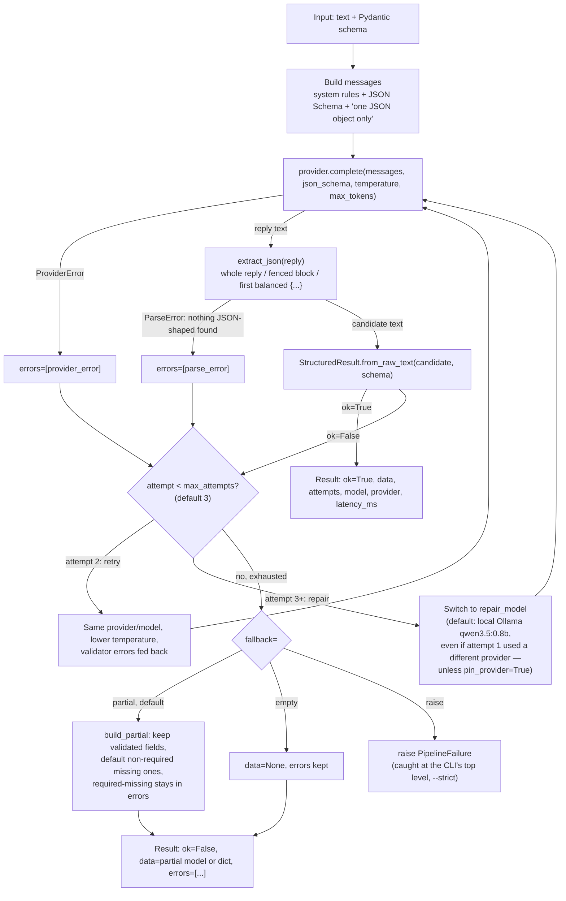

# Architecture

The real, connected flow is `engine.pipeline.Pipeline.run(text, schema)`
(`src/engine/pipeline.py`, Phase 4); text in, a real `Provider.complete()`
call, `StructuredResult` out. (An earlier `StructuredOutputEngine`,
`src/engine/core.py`, Phase 1, called an older, narrower provider interface
and was never connected to a real provider; deleted in Phase 8; `Pipeline`
was always the real path.)

Every attempt; success or failure, including a `ProviderError`; is logged
(`logging.info`: attempt, stage, provider, model, ok, latency_ms, error
types, a raw-reply snippet).

## Notes

- **A provider error consumes an attempt, like a validation failure does.**
  It doesn't short-circuit immediately (the deleted Phase 1
  `StructuredOutputEngine` did); the point is that if the *initial*
  provider is down, attempt 3's switch to the (different, by default)
  repair provider can still succeed.
- **A repair-stage provider switch unloads the outgoing model first**
  (`old_provider.unload(old_model)`, best-effort, Phase 8); skipped when
  the provider has no `unload` or `pin_provider=True` keeps the same one.
  See `docs/RUNBOOK.md` "VRAM unload order".
- **Extraction is lenient by design.** `extract_json` returns the best
  candidate substring it can find even if it's still syntactically broken.
  That is what `StructuredResult.from_raw_text`'s own JSON/schema validation
  is for. `ParseError` (→ `errors=[type="parse_error"]`) only fires when
  none of the three strategies find anything resembling a JSON object at
  all (e.g. a plain-prose refusal).
- **`fallback="partial"` never returns `ok=True`.** Even when the
  reconstructed data happens to satisfy the schema fully (e.g. the only
  problem was a field with a usable default), the result still reports
  `ok=False`; a fabricated/defaulted field was involved, so it's not the
  same guarantee as a model's own valid output.

## History: `StructuredOutputEngine` (Phase 1, deleted Phase 8)

`src/engine/core.py`'s `run()` predated the `complete()` provider interface
(Phase 3) and expected an older `generate(*, model, prompt, schema) -> str`
shape that nothing ever implemented, so it never played a role in a real
run; `Pipeline` above was always the connected path. Deleted in Phase 8
along with its test (`tests/test_engine.py`).
