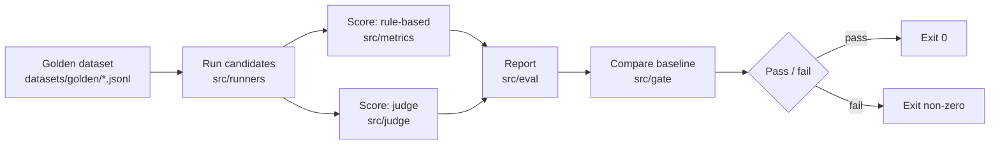

# Architecture

## Components

| Path | Responsibility |
|---|---|
| `src/dataset` | Load and validate golden JSONL cases |
| `src/providers` | Ollama / Agnes AI / OpenAI-compatible / Gemini clients |
| `src/runners` | Run a candidate model over each dataset case |
| `src/metrics` | Deterministic (rule-based) scoring |
| `src/judge` | LLM-as-judge scoring, Pydantic-validated output |
| `src/gate` | Baseline comparison and pass/fail decision |
| `src/eval` | Orchestrates the pipeline end to end, produces the report |
| `src/ui` | Streamlit frontend |

`src/llm_eval_harness/__init__.py` is not a pipeline component. It is an empty package root
required because the `uv_build` backend (`pyproject.toml`) maps the project name
`llm-eval-harness` to it. All real code lives in the flat `src/<module>` packages listed above.
