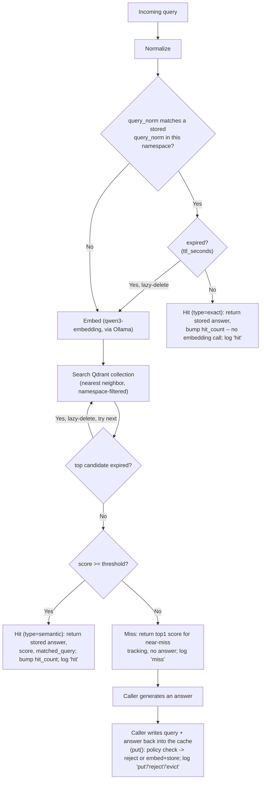

# Architecture

Phase 6: every stage below is implemented, including the Streamlit UI
(`src/ui/app.py`) and the generate-on-miss demo providers (`src/providers`).

## Lookup flow

The exact-match check is a namespace-filtered Qdrant `scroll` payload lookup
with no vector involved. It runs before any embedding call.

Every branch that returns a `Hit`/`Miss`, and every `put()` outcome
(stored, rejected, or triggering an eviction), appends one line to
`data/cache/metrics.jsonl` (`docs/METRICS.md`); logging isn't a separate
pass over the data, it happens inline where each decision is made.

## Stages

| Stage | Responsibility | Lives in |
|---|---|---|
| Normalize | Deterministic text cleanup (strip/collapse whitespace, optional lowercase/trailing-punct) so near-identical phrasing embeds close together | `src/cache/normalize.py` |
| Exact-match short-circuit | `query_norm` payload lookup, namespace-filtered, no vector | `src/store/qdrant_store.py` (`find_exact`) |
| Embed | Call Ollama `/api/embed` with the configured model | `src/embed/ollama_client.py` |
| Search | Nearest-neighbor query against the Qdrant collection, namespace-filtered | `src/store/qdrant_store.py` |
| Threshold | Compare the top hit's score against the configured cutoff (default 0.89) | `src/cache/service.py` |
| Hit path | Return stored answer, increment `hit_count`/`last_hit_at` | `src/cache/service.py`, `src/store/qdrant_store.py` |
| Miss path | Return a miss with the top-1 score for near-miss tracking; storing a new answer is the caller's job | `src/cache/service.py` |
| Policy | TTL expiry (lazy delete), max-entries eviction, min-length/never-cache rejection, namespace, cross-model serving; `config/cache.yaml` | `src/policy/config.py`, `src/policy/enforcement.py` |
| Metrics | Per-call event log + hit-rate aggregation | `src/metrics/logger.py`, `src/metrics/aggregator.py` |
| Providers | Optional generate-on-miss demo (one `urllib` call per provider) | `src/providers/generate.py` |
| UI | Streamlit front end: namespace/threshold/embed-model controls, lookup, generate-and-store, metrics table, clear/export | `src/ui/app.py` |

## Explicitly out of the lookup path

Generation on miss is not performed by the cache itself; `src/providers`
exists only to demo what a caller might do after a miss, wired into the
UI's "Generate and store" button. See [`docs/CACHE_POLICY.md`](CACHE_POLICY.md)
and [`docs/TECHNICAL.md`](TECHNICAL.md) for the pieces this diagram glosses
over (dimensions, distance metric, threshold units).
