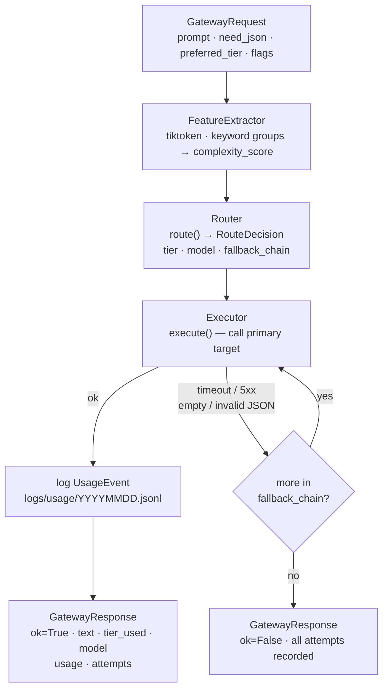

# Architecture

## What this service is

The Model Routing Gateway routes requests, handles fallbacks, and tracks cost. It receives a prompt, classifies its complexity, selects a tier, calls the model, retries failures, and returns a `GatewayResponse` with text, usage counts, and a cost estimate.

---

## Request flow



---

## Module map

```
src/
  gateway/
    models.py          GatewayRequest · RequestFlags · TierName
                       RouteDecision · ReasonCode
                       GatewayResponse · AttemptRecord · UsageRecord
    features.py        FeatureExtractor · Features · ComplexityLabel
    __main__.py        CLI: python -m src.gateway --text "..."
  route/
    router.py          route() · load_tiers() · AvailabilityFn
    executor.py        execute() → GatewayResponse · ProviderFn
    eval.py            routing eval runner (merge gate, no GPU)
  providers/
    availability.py    default_available(provider, model) → bool
    base.py            ProviderError · MissingKeyError · ProviderResult
    ollama.py          complete() → ProviderResult via /api/chat
    agnes.py           complete() → ProviderResult via Agnes AI
    openai_compat.py   complete() → ProviderResult (OpenAI-compatible)
    gemini.py          complete() → ProviderResult via Gemini REST
  cost/
    ledger.py          load_prices() · estimate_cost() · log_event() · aggregate()
    __main__.py        CLI: python -m src.cost --day today
  ui/
    app.py             Streamlit front-end (Playground / Dashboard / Config)

config/
  tiers.yaml           tier → ordered target list (provider, model, timeout_s, vision_ok, …)
  prices.yaml          per-model {in_per_1k, out_per_1k} — Ollama=0, cloud=estimates
  features.yaml        keyword groups · token buckets · feature_weights · thresholds

logs/usage/            YYYYMMDD.jsonl — one UsageEvent per request
tests/
  test_gateway.py      29 checks — GatewayRequest + FeatureExtractor
  test_router.py       22 checks — RouteDecision
  test_executor.py     22 checks — fallback loop
  test_cost.py         19 checks — cost arithmetic
  eval/routes.jsonl    5 routing eval cases
```

---

## Complexity scoring

`FeatureExtractor` scores every request **deterministically** (no LLM call):

```
complexity_score =
    min(1, keyword_weight_sum) × 0.35   # keyword groups from config
  + token_bucket_score          × 0.30   # tiktoken cl100k_base
  + has_code_fence              × 0.10
  + has_json_hint               × 0.10
  + need_json                   × 0.10
  + min(1, n_sentences / 20)    × 0.05
```

Labels: `simple` (< 0.35), `medium` (0.35 to 0.64), and `hard` (≥ 0.65)

---

## Hard routing rules (code, not config)

| Condition | Effect |
|-----------|--------|
| `complexity_label == "hard"` AND `need_json` | lite targets ineligible |
| `flags.has_image` | only `vision_ok: true` targets eligible; no vision target → `status=unsupported` |

---

## Key constraints

- Offline path: tiktoken only; no network calls for routing or cost logic.
- One Ollama model at a time (RTX 4060 8 GB VRAM ceiling).
- Missing provider key or unreachable host → target silently skipped.
- Promotion is only upward: lite → mid → heavy. Never downward.
- 5xx errors: retry once per target, then treat as failure.
- Cost figures are config-driven estimates; never read from invoices.
