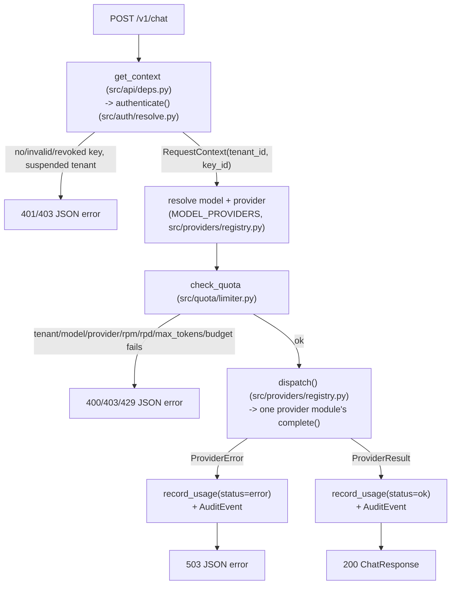

# Architecture

## Request flow

`POST /v1/chat` (`src/api/app.py::chat`), the only route that reaches an
upstream provider:

`GET /v1/models`, `GET /v1/usage`, and the `/admin/tenants/...` routes
follow the same auth step (`get_context` for tenant routes,
`require_admin` -> `verify_admin` for admin routes, both in
`src/api/deps.py`) but do not call `check_quota` or any provider — they
only read or write rows through SQLAlchemy.

## Main types and where they live

| Type | File | Notes |
|---|---|---|
| `Tenant`, `ApiKey`, `PlanLimits`, `UsageEvent`, `AuditEvent`, `PromptLog` | `src/db.py` | SQLAlchemy 2.0 ORM models, one `Base`, one file |
| `RequestContext` | `src/auth/context.py` | frozen dataclass: `tenant_id`, `key_id` — the only way a route learns who is calling |
| `QuotaStatus` | `src/quota/limiter.py` | dataclass returned by `remaining_quota()` |
| `ProviderResult` | `src/providers/base.py` | dataclass: `text`, `in_tokens`, `out_tokens` — the common return shape every provider module produces |
| Pydantic request/response models (`TenantCreate`, `ChatRequest`, `UsageReport`, etc.) | `src/schemas.py` | one file, all schemas |
| `AuthError`, `QuotaError`, `ProviderError` (and subclasses) | `src/auth/errors.py`, `src/quota/errors.py`, `src/providers/errors.py` | each carries a `code: str` and `http_status: int`; caught by exception handlers in `src/api/app.py` |

All ORM models live in one module (`src/db.py`) rather than split per
domain package; the module's own docstring gives the reason (they share
foreign keys and are few enough that splitting them would add indirection
without benefit). Business logic that operates on them lives in the owning
domain package instead: `src/auth`, `src/tenants`, `src/quota`,
`src/usage`.

## External systems the code calls

Four upstream LLM providers, each with its own adapter module under
`src/providers/`, all reached through the single `dispatch()` function in
`src/providers/registry.py`:

| Provider key | Module | Library | Reached via |
|---|---|---|---|
| `ollama` | `ollama_provider.py` | `ollama` (PyPI) | `OLLAMA_HOST`, default `http://127.0.0.1:11434` |
| `agnes` | `agnes_provider.py` | `openai` (PyPI), via the shared `openai_style.py` | fixed URL `https://apihub.agnes-ai.com/v1` (in code, not an env var), key from `AGNES_API_KEY` or `AGNESAI_API_KEY` |
| `openai_compatible` | `openai_compatible_provider.py` | `openai` (PyPI), via `openai_style.py` | `OPENAI_BASE_URL`, key from `OPENAI_API_KEY` |
| `gemini` | `gemini_provider.py` | `google-genai` (PyPI) | Google's default endpoint for that SDK; key from `GOOGLE_API_KEY` |

`src/providers/registry.py::MODEL_PROVIDERS` is a fixed dict mapping
specific model name strings (e.g. `granite4.1:3b`, `gemini-3.7-flash`) to
one of the four provider keys above. It is hardcoded in that file, not
read from configuration or the database.

No other external system is called anywhere in `src/`: no message queue,
no cache server, no object storage, no second database. The only
persistence is the single SQLite file described in `docs/TECHNICAL.md`.

Hardware/deployment topology (what machine this runs on, GPU availability,
process placement) is not recorded anywhere in this repository and is
therefore not documented here.

## Admin routes and the Streamlit UI

`src/api/admin_routes.py` defines an `APIRouter` with
`dependencies=[Depends(require_admin)]` set once on the router, so every
route under it requires `X-Admin-Token` without repeating that dependency
per route. The route functions are thin: they 404 (via `HTTPException`,
not the app's usual `{"error": ...}` shape — see `docs/RUNBOOK.md`) when a
`tenant_id` or `key_id` doesn't resolve, call one function in
`src/tenants/service.py`, write an `AuditEvent`, and commit.

`src/ui/app.py` (Streamlit, single file) holds no direct import of
`src.db` or any service function. It calls the admin HTTP routes above
through `httpx`, using the same `X-Admin-Token` header any other client
would send. The admin token is kept in `st.session_state` only.
