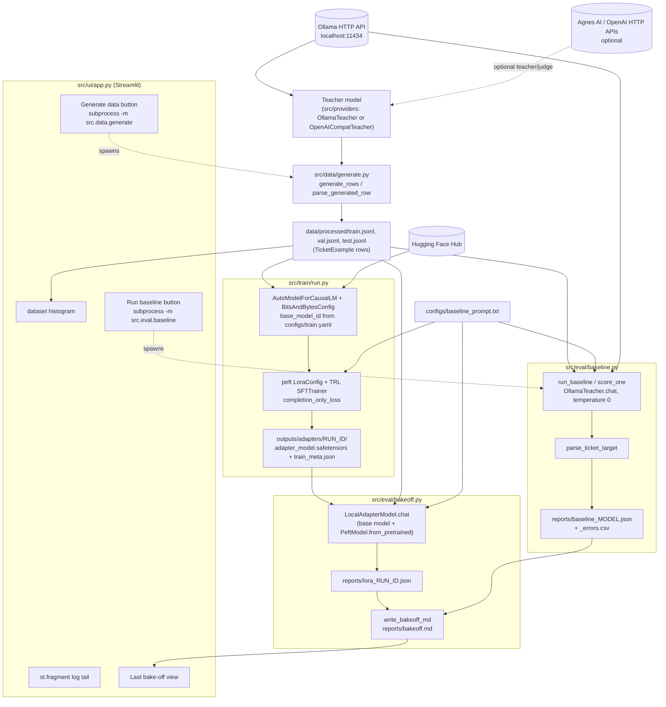

# Architecture

This describes the pipeline as it exists in `src/`, not an intended future design.

## Data/process flow

## Main types/state, and where they live

- **Pydantic models** — `src/data/schema.py`: `TicketTarget` (the 4-field label enum),
  `GeneratedRow` (ticket text + label, as produced by the teacher), `TicketExample` (input, target,
  split, source, teacher_model — the persisted row shape). `load_examples` reads a jsonl file into
  a `list[TicketExample]`.
- **Provider clients** — `src/providers/base.py` defines two `Protocol`s: `TeacherClient`
  (`.complete(prompt)`) and `ChatClient` (`.chat(system, user, temperature)`). `OllamaTeacher`
  (`src/providers/ollama.py`) and `OpenAICompatTeacher` (`src/providers/cloud.py`) implement both;
  `LocalAdapterModel` in `src/eval/bakeoff.py` implements `ChatClient` only, so it can be scored by
  the same `run_baseline` function as the Ollama-backed baseline.
- **On-disk state:**
  - `data/processed/*.jsonl` — one `TicketExample` per line.
  - `outputs/adapters/<run_id>/` — `adapter_model.safetensors`, `adapter_config.json`,
    tokenizer files, and `train_meta.json` (the training config actually used, VRAM peak, steps,
    final loss — see `src/train/run.py`'s `meta` dict).
  - `reports/baseline_<model>.json` / `lora_<run_id>.json` — output of `aggregate_metrics` in
    `src/eval/baseline.py`, plus a `_errors.csv` of the non-exact-match rows.
  - `reports/bakeoff.md` — human-readable comparison table and verdict text
    (`write_bakeoff_md`/`write_adapter_missing_md` in `src/eval/bakeoff.py`).
  - `outputs/train.log` — written by `train.cmd`'s `Tee-Object`, read by the Streamlit UI's log
    tail. Not written by any Python code in this repo — only by the batch script.

## External systems the code calls

- **Ollama's local HTTP API** (`http://localhost:11434`, the default in
  `src/providers/ollama.py`) — `/api/generate` (`OllamaTeacher.complete`) and `/api/chat`
  (`OllamaTeacher.chat`). Used for the teacher (data generation), the prompt-only baseline, and the
  repair pass.
- **Hugging Face Hub** — `AutoModelForCausalLM.from_pretrained` / `AutoTokenizer.from_pretrained`
  in `src/train/run.py` and `src/eval/bakeoff.py` download the base model
  (`base_model_id` in `configs/train.yaml`) from `huggingface.co` over the network the first time
  it's used (then cached locally by `huggingface_hub`).
- **Agnes AI / OpenAI HTTP APIs** (`https://apihub.agnes-ai.com/v1`, `https://api.openai.com/v1` —
  both literal URLs in `src/providers/__init__.py`) — only called if a teacher/judge argument
  selects `agnes-2.5-flash` or `gpt-5.6-luna`; not used by any default flag value in this repo.
