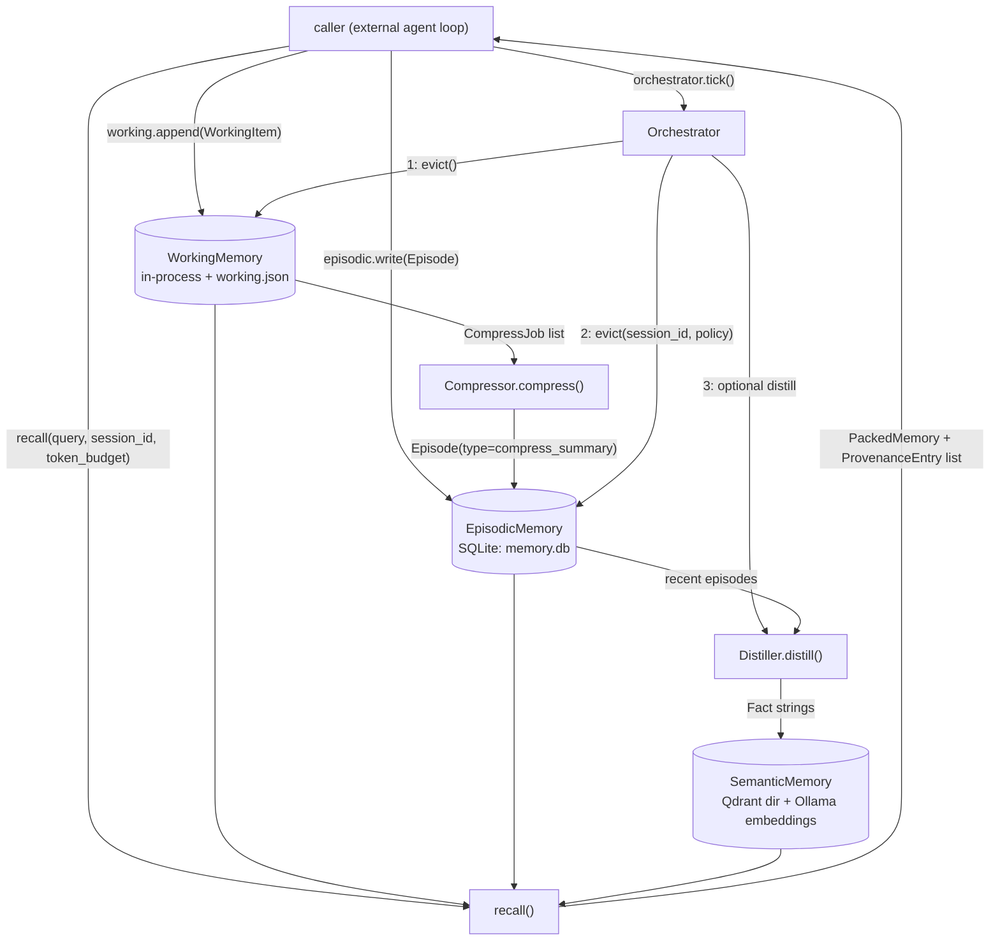

# Architecture

## Data flow

`Orchestrator.tick()` is the only thing that runs eviction/compression/
distillation; nothing in the repo calls it automatically. `recall()` is a
free function, not a method on any store class (`src/memory/recall.py`).

## Main types and where they live

| Type | File | Persisted where |
|---|---|---|
| `WorkingItem`, `CompressJob` | `src/memory/working.py` | JSON list, `data/memory/working.json` (only on explicit `.snapshot()`) |
| `Episode`, `EvictionPolicy` | `src/memory/episodic.py` | SQLite table `episodes` + FTS5 table `episodes_fts`, `data/memory/memory.db` |
| `Fact`, `FactMatch` | `src/memory/semantic.py` | Qdrant collection `facts` (embedded, `data/memory/qdrant/`); the full `Fact` is the point payload; no separate metadata table |
| `CompressResult`, `DistillResult` | `src/memory/compress.py` | not persisted; returned in-process |
| `MemoryConfig`, `MemoryReport` | `src/memory/orchestrator.py` | `MemoryConfig` loads from `config/memory.yaml`; `MemoryReport` is a return value, not persisted |
| `ProvenanceEntry`, `PackedMemory` | `src/memory/recall.py` | not persisted; returned in-process |

`WorkingMemory`, `EpisodicMemory`, and `SemanticMemory` are the three
stateful classes; each owns one persistence mechanism (in-process list +
JSON file, a `sqlite3.Connection`, and a `qdrant_client.QdrantClient`,
respectively). `Orchestrator` holds references to one instance of each
plus a `Compressor` and a `Distiller`; it does not construct the three
stores itself (see `src/memory/ui.py` and `scripts/seed_demo.py` for how
callers construct and pass them in).

## External systems

- **Ollama** (`ollama` Python package, local HTTP service, default
  `127.0.0.1:11434`, not configured to any other host anywhere in this
  repo). Called from `semantic.py` (`ollama.embed`, for the embedding
  model) and `compress.py` (`ollama.chat`, for the compress/distill
  model). Nothing else in `src/` imports `ollama`.
- **Qdrant** is not an external system here: `QdrantClient(path=...)`
  runs embedded, in-process, against a local directory
  (`data/memory/qdrant/`). No Qdrant server is started or connected to.
- **SQLite** is a local file (`data/memory/memory.db`), accessed through
  the standard library `sqlite3` module.

No other network calls, queues, or external services appear in `src/`.
`src/memory/config.py` defines constants for Agnes AI, an OpenAI-compatible
endpoint, and Gemini (base URL, model names), but no code in the repo
currently makes a request to any of them.
